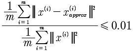
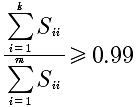

# Lesson14 降维

## 14-1 数据压缩
降维的过程可以将多个特征量合并成一个，这样就产生了数据压缩特性。

## 14-2 数据可视化
降维的好处是多个维度的数据能够降低3维或者2维，在这个维度上可以对数据进行可视化。

## 14-3 降维算法-主成分分析法(PCA)
OCTAVE算法:

	Σ = (x(1) * x(1)' + x(2)*x(2)' + ... + x(m)*x(m)')/m;
	// Σ = (X'*X)/m 如果X是所有行向量组成的数据 上面是基于x都是列向量的算法
	[U, S, V] = SVD(Σ);
	Ureduce = U(:, 1:K);
	Z = U'*X;
	
最终: Z ∈ R^k*1 而X属于R^n*1 ， 所以实现了降维.

注意: x(i)是列向量

## 14-5 选择K的方法
上面给出了降维的方法，那么究竟从n维降到多少维才是合适的呢？遵从下面的方法:

这表示99%的误差被保留，这是很高的标准。可以降低到0.05，那就是95%的误差被保留。

那么在OCTAVE中如何计算呢?

	[U, S, V] = SVD(Σ);
	
计算的结果S是一个对角矩阵，所以上面的公式就变成了:

前k个对角矩阵的相加和除以所有对角元素的相加和。

而这个算法事实就是:

	循环k=1:n
	计算每一个 除数因子是否 >= 0.99
	直到找到最小的k，满足这个条件
	
## 14-6 原始数据重建
我们如何通过Z重建X呢？通过 

	Z = U'*X 得出 X = U*Z.
	
注意最后计算的X和原先是有差别的称之为X_approx，是一种近似，因为投影产生的信息丢失是无法完全映射回去的。就像上节14-5中所描述的X_approx那样。

这里还有个疑问就是:

	X = pinv(U')*Z，
	
难道 pinv(U')=U？在NG的课上面并没有这个解释。
	
## 14-7 PCA在监督学习中的应用
PCA在监督学习中，可以将数据降维从而加速运算。具体的方法是:

1 先对X进行降维到Z, 映射记做 map
2 进行监督学习的就是(Z, Y)

但这里需要注意的是，这里仅仅是用作训练的，用作训练参数.将在训练集上得到这种映射关系，应用到交叉验证集和测试集，将Z映射到Z，再带入到假设函数中进行预测。

PCA有一些错误的用法？要特别注意不要使用

1、 用来处理过拟合。因为过拟合是因为特征量过多，所以通过PCA来降低特征量。因为处理过拟合的最好的方法是正规化而不是PCA,虽然有些时候PCA能够解决过拟合的问题。对于我们使用PCA来说的，目的就是加快算法的速度和在存储空间上要求过于巨大的时候才考虑PCA，正常的情况下我们最好选择原始数据，因为PCA必定是会损失一些信息的。例如在图像方面，可以考虑PCA，因为图像大小越大产生的特征越多越复杂。

## 总结
这里主要讲述了PCA的方法，进行降维处理。所谓的降维就是将多个特征值合并成一个。这么做的好处，是减少的维度，加速的计算，而主要使用的算法就是PCA。

这里唯一要说明的就是，线性回归与降维很像，但是，绝对不是一个东西。

## 参考资料
[主成分分析](http://blog.csdn.net/xiaoyu714543065/article/details/7832132)

[PCA&SVD](http://blog.csdn.net/xiaoyu714543065/article/details/7845251)