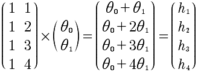

#Lesson3
矩阵和向量相乘的代数意义。在计算方程的时候是非常好的方法。这也是，我们需要扭转的思想，通过线性代数的思想去思考问题。例如:

	hθ(x) = θ0 + θ1x
	
对于x取值为 x1 = 1, x2 = 2, x3 = 3, x4 =4，分别求h1, h2, h3, h4，那么，针对这样的求解，就可以转换成矩阵的乘法来计算。h(x) = θ0 * 1 + θ1 * x。具体乘法如下:

使用这种方法来计算多个数据的方程式效率更高，而不是对x进行循环然后逐个去求解。因为对于计算机来说，进行矩阵运算是可以进行优化的。

针对一种θ的取值，可以这样做，显然，当进行多组计算的时候，这种计算就更加方便。例如:
同时对四组h(x)进行计算。h(x)的方程组如下:

针对x1 = 1, x2 = 2, x3 = 3, x4 =4, 这四种取值对应h(x)的四个函数，一共会有16组h的计算结果，可以使用矩阵同时求出。看上面的解释就很容易明白，对θ向量再增加机组即可。所以，最终的矩阵如下:

这样非常完美，一个矩阵相乘能够计算出16组测试结果。与上面的分析是一致的。

什么样的矩阵有逆矩阵呢？必须满足两个条件 1 必须是方阵。也就是说必须是n*n 2 存在着A*A的逆=I