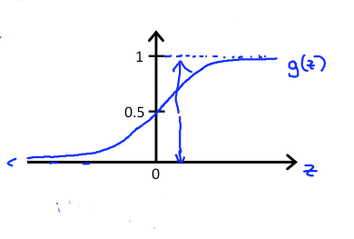
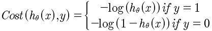
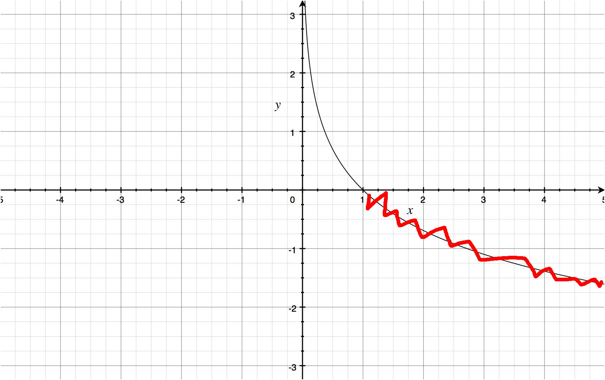
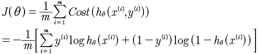

# Lesson6
## 6-1
第六课，开始介绍分类算法，logistic 分类算法。对于前面学习的线性回归算法来说，是无法适应在分类算法的。因为线性回归算法是连续的数据集，而对于分类算法来说，是对在同一个分类中不同的分类产生的概率。

为什么不能使用线性回归来进行分类测试呢？是因为分类取值y 属于{0, 1} 而对于h(x)来说，可能产生 h(x)>1 和 h(x)<0，这两种情况，那么这并不是合理的。所以线性回归是不能进行分类的。而应该使用 h(x)属于[0, 1]的假设函数。

## 6-2
分类算法的数据原型，是癌症的良性和恶性计算。

| 良性/恶性 0/1 | 肿瘤大小 |
|:------------:|:-------:|
| 0 | 2 |
| 1 | 4 |
| 1 | 6 |
| 0 | 1 |

对于分类算法来说，是通过肿瘤的大小来计算良性还是恶性的概率。所以对于hθ(x)是计算概率也就是:
	
	hθ(x) ∈ [0, 1]
	
所以这是问题的关键，通过这一点就明白为什么线性回归在这里无法工作的原因了。因为线性回归是没有区间限制也就是概率的处理.但是，可以通过对线性回归的函数进行变换，形成在[0, 1]之间。

通过上面的g(x)可以知道，g(x)∈[0, 1]。

所以对于概率上的表示就是 

	P{y=1 | x;θ} + P{y=0 | x;θ} = 1
	
h(x)的含义是什么？ h(x)=0.7 表示的是y=1的概率是70%。h(x)的数值表示的是出现y=1的概率，也就是 P{y=1 | h(x) } = P{y=1 | x, θ}。也就是说当我们求出了逻辑回归的假设函数h(x) 我们就能够知道他为1的概率。用来预测股票的涨和跌，可以使用。计算出来h(x)，就计算出了明天上涨的概率，然后通过凯利公式计算头寸。
	
## 6-3
决策边界。这一节主要介绍的是决策边界的问题。

	预测y=1, 如果h(x)>=0.5
	预测y=0，如果h(x)<0.5
	
注意这里的h(x)的取值，事实上我们可以取值为任意数值，例如 y=1, 如果h(x)>=0.7，这样做的好处是增加成功率. 所以本质上逻辑回归就是在计算概率，根据概率大于阈值来确定一个y究竟是否是1. 这在股票的预测中尤为有用。

对于g(x)函数来说，通过图像我们可以知道，对于最终的计算结果来说，要么是0要么是1，那么认为g(x) >= 0.5 和 g(x) < 0.5两个区间进行分析。对于x的取值来说就是 x >=0 和 x < 0。所以对于x = 0来说，就是边界条件。对应到前面的函数就是:

	θ'X = 0

这个就是边界条件。对于两个变量的函数如下: 

	θ0 + θ1x1 + θ2x2 = 0 

所以可见，对于x1, x2来说是一个直线。当然在进行拟合的时候，也可以使用多项式拟合，例如:

	θ0 + θ1x1 + θ2x2 + θ3x1^2 + θ4x2^2= 0
	取 θ0 = -1, θ1 = 0, θ2 = 0， θ3 = 1, θ4 = 1，那么，
	x1^2 + x2^ = 1，显然这是一个圆。所以决策边界就是一个圆的区域。
	
## 6-4
代价函数的计算。使用线性回归的代价函数式无法计算的，因为现在的函数是指数函数，所以在收敛上是个问题，换句话说，不是凸函数。那么，如何转换成凸函数呢？

什么是代价函数？代价函数式对θ的一种拟合方式，也就是讨论 hθ(x)和y的关系的最贴近的拟合方法。在线性回归上面的方法是，hθ(x)和y的方差来决定的，是所有的hθ(x)与y的方差最小的函数。通过这一点，我们可以得知，代价函数就是 对不同的θ的取值，然后不停的迭代所有的x，使得所有的hθ(x)与y的值最小的一种方法。代价函数式对“所有”数据的一种折中的拟合函数。

所以对于现在来说，既然y=1或者y=0，所以就分两种拟合方法，对所有的y=1，使用 -log(hθ(x)) 来处理y = 1的情况。
 
对于两者的代价函数的图像如下:

因为h(x)的取值范围是[0, 1]，所以只关注这一个区间的图像即可。通过图像我们看到当h(x)趋近于1的时候，代价函数趋近于0，这里的含义就是y=1的时候代价函数最小，这正是我们需要的；而当h(x)趋近于0的时候，代价函数趋近于无穷大，也就是当y=0的时候，代价函数无穷大，这是正确的结论，也就是。对于概率还说正是如此。

同样对于y=0的函数图像如下图，依然是 h(x)∈[0, 1].

这里告诉我们，如果你的代价函数，不是一个凸函数，那么将无法进行梯度下降的收敛。所以无论如何要通过函数的变换将其变成凸函数。

## 6-5
代价函数的最小化问题。首先，需要对代价函数的分段表示方式变成统一的表达式。如下:

通过将Cost函数变成统一的表达式，剩下的就容易多了。求 min(J(θ)），具体的思想与线性回归是差不多的。使用梯度下降法。推导如下:

我们看到最终推导迭代结果与线性回归的是一样一样的。

## 6-6
这一部分主要是教会我们使用更快速和更高级的方法来优化梯度算法的收敛。主要函数是:

	fminunc
	参数包括: optimset
	
	
通过fminunc函数来自动的进行梯度下降，来自动的使用不同的θ进行迭代来，找到最小的J(θ).所以到这里，你明白了，在数学上推导的梯度下降的θj的迭代下降，是通过这里的fminunc函数来自动进行处理的，省得我们自己写循环来进行比较。书写的标准格式如下:

	theta 初始向量 [00, 01, ..., 0n]的转至
	function [jVal, gradient] = constFunction(theta)
		jVal = [code to compute J(θ)]
		gradient(1) = [code to compute 偏导θ]
		gradient(2) = [code to compute 偏导θ]
		...
		gradient(n+1) = [code to compute 偏导θ]
		
使用OCTAVE或者MATLAB的库函数进行梯度下降，比我们先前自己完成的更快，因为会有很多自动优化，例如α的自动选择。所以，以后就使用 fminunc 函数来自动进行梯度下降，而不是自己再次书写。

## 6-7
前面我们所进行的分析都是基于0， 1的两个数据的分类，在这部分来解决处理多种分类的问题，例如 1， 2， 3 的分类问题。计算的思想是：

	h1: 1， （2， 3） 计算出h1;
	h2: (1, 2), 3 计算出h2
	h3: 2, (1, 3) 计算出h3
	最后计算 h = max(h)
	
所以总体的逻辑还是基于0， 1分类的计算。