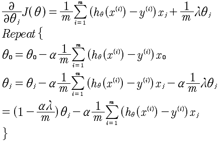
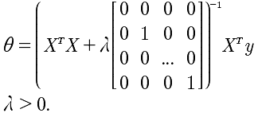

# Lesson7

## 7-1
这里介绍了拟合中的两个问题，分别是欠拟合和过拟合。所谓的欠拟合，是指选取的特征变量过少，而使得不能很好的拟合大部分数据。而所谓的过拟合，是指追求对每一个样本数据的精准拟合而导致特征变量过于复杂。这两种都是不对的做法。对于过拟合来说，可以考虑减少某些特征量，但是，减少了意味着丢掉某些信息。

## 7-2
正规化来对欠拟合和过拟合的处理。引入正规化处理的目的是使得，很多的特征量能够对影响很小的特征量处理掉，这样能够使得代价函数更加简洁，拟合的更加好。

从公式上看出，对于λ项的引入是对J(θ)整体的调整，而不是对每一个样本的调整。

在这里的最后一项是代价函数没有项，通过最后一项来对所有的θ进行惩罚，将关联度低的进行消除。一般会设置 λ 为一个比较大的数，例如10^10 以便对θ对比较大的惩罚，产生较小的θ。注意上面的代价函数中 正规化参数中θ是从1开始的而不是0，对于θ0的惩罚意义不大。

那么，惩罚的原理又是什么呢？是如何做到惩罚的呢？
	
	因为，我们需要Minimize(J(θ))，所以如果λ的值很大，要想 J(θ) 很小，那么一定是 θ 的值很小，才能使得 J(θ) 很小。反之，如果λ很小，相当于正规化的那一项被忽略了，等于对θ没有改变。这就是λ对θ的直观解释。
	
那么，又是如何反应到假设函数h(θ)上的呢？

	当，通过梯度下降来求解 Minimize(J(θ)) 的时候，自然会将λ计算在内，因为这个因素的影响，就会计算出较小的θ。也就是完成了对θ的惩罚。

## 7-3
基于上面的方程，对于梯度下降法来说，计算结果如下:

对于θ0来说，是没有λ项的。对于其他的θ来说在进行下降的时候使用了 1-αλ/m作为系数，所以对于θ来说的下降来说是逐渐变小的。

对于非梯度下降的正规方程法来说，

这个正规化的好处是，逆矩阵是一定存在的，这是可以证明的。小遗憾，这个方程的具体推导我还没有搞清楚。

## 7-4
对于逻辑回归来说也是同样的表达式。
