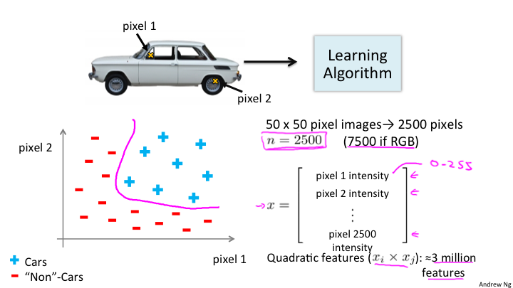
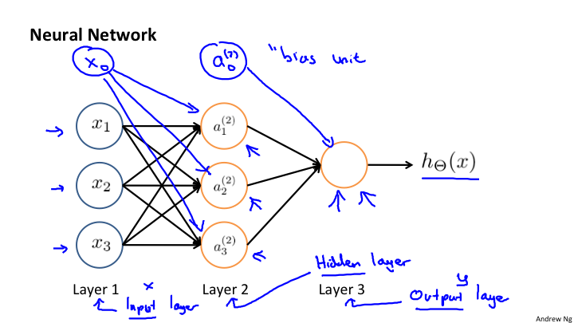
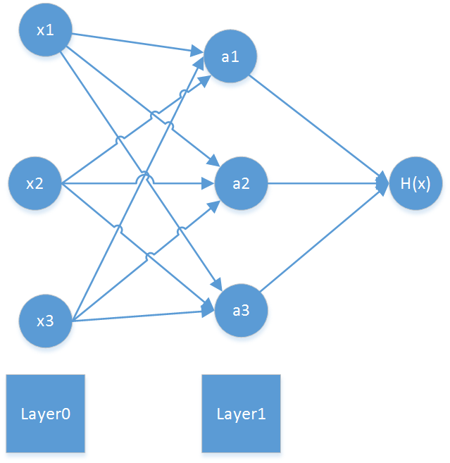
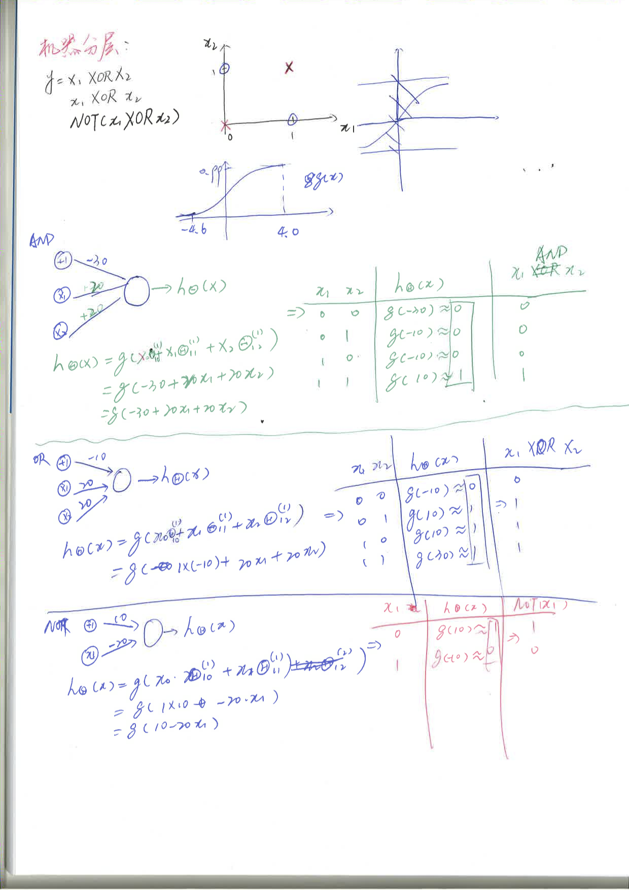
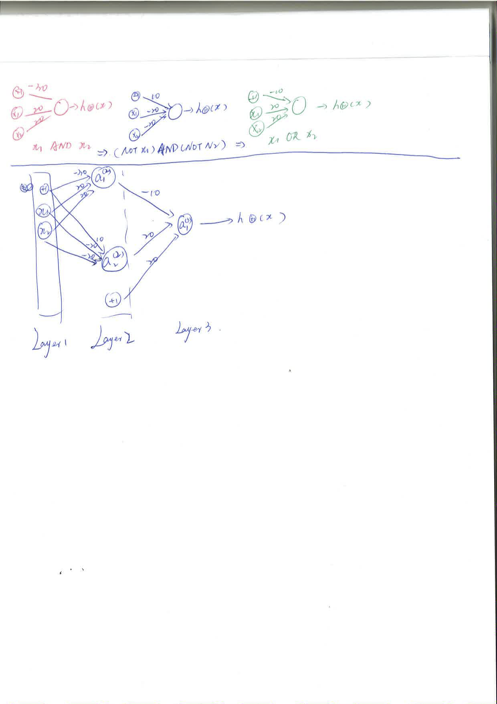

# Lesson8

## 8-1

神经网络的机器学习。在使用逻辑回归或者线性回归的时候如果参与的特征量过于多，那么基于多项式的函数将会出现及其复杂的现象。所以引入神经网络来解决这个问题。例如，在图像识别中的问题。

如图，将汽车图片的每一个像素的位置，是汽车用加号表示不是汽车用建好表示，那么有多少个像素相当于有多少个特征值，所以对于这个问题来说特征值就是图片的大小所包含的像素数。例如50*50 = 2500个像素，如果每个像素用3个字节来表示，那么就是2500 * 3=7500个字节，每一个字节作为一个特征量。换句话说是否是一个汽车是通过所有像素点来决定的，所以特征量就是所有像素点。

## 8-2
神经网络是模拟大脑的算法。任何一种传感器接入大脑，大脑都会自己学习如何处理这些数据。这就是神经网络的理论基础。

## 8-3

神经网络模型，是根据不同的层进行处理的。

具体的数学公式如下:

	a的上标是层级，下标是第几个单元。 Θ上标表示layer，下标表示当前矩阵的第几个值。

## 8-4 8-5 8-6
具体的计算实例参考下面的计算过程。

