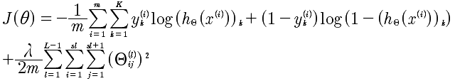
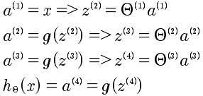
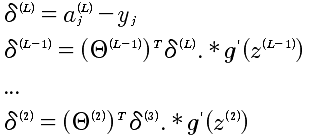

# Lesson9 神经网络学习
## 9-1 代价函数
还记的在逻辑回归中的分类问题,对进行0 1，这样的简单分类是容易解决的。可是如果是0 1 2 3 4 这样的分类讲是非常痛苦的。但是这些在神经网络中的处理确容易了许多。基于神经网络的代价函数如下:

	K: 表示K类的数量。例如 0 1 2 3 那么就是4

逻辑回归函数

所以，这个公式与逻辑回归的代价函数进行对比.其实，仅仅是多了K个分类的处理。加入正规化的最终的函数如下:

在逻辑回归中最后一项是所有θ的平方和,在这里也是同样的。

	L： 表示层数
	i,j: 对应于每一层的每个Θ的下角标
	
## 9-2 反向传播算法

要搞清楚反向传播算法，先看看向前传播算法的计算过程。如下图:

推导过程如下:

现在的问题是有了代价函数我们需要计算J(θ)的偏导数。正向计算太难了，于是使用了反向传播算法。至于这个算法的原理，暂时不用管，记住结论如下。

反向传播算法:

	

具体的计算梯度下降的偏导如下:

	

## 9-3 反向传播算法的解释

对delta来说，其实就是表示的偏差，那么所以就是使用偏微分即可表示。

	

另外，如果从正向的传播去思考反向传播也是可以的。因为i层的delta偏差，传递给i+1层是分散的。

	

这样理解和推导也是可以的。

## 9-4 辗转参数
对于每一层的Θ来说都是一个矩阵，例如 s1=10, s2=10, s3=1 那么对应的 Θ1 10*11 矩阵， Θ2是10*11， θ3是 1*11.

对于δ来说 δ1 是 10*11 δ2是10*11 δ3是 1*11

对于计算函数来说

	fminunc(@costFunction, initialTheta, options)
	
现在的问题就是Θ变成初始化向量，现在的Θ是矩阵。

	thetaVec = [ Theta1(:); Theta2(:); Tehta3(:)];
	DVec = [D1(:); D2(:); D3(:)];
	Theta1 = reshape(thetaVec(1:110), 10, 11);
	Theta2 = reshape(thetaVec(111:220), 10, 11);
	Theta3 = reshape(thetaVec(221:231), 1, 11)
	
## 9-5 梯度检验

在实现反向传播算法的时候，因为算法过于复杂所以很容易出现细节的错误，而更要命的是细节的错误你可能无法发现。于是，这时候我们需要梯度检验来帮助鉴别梯度下降。

先看看导数的计算方法，对于给定函数J(Θ)，那么

	d(J(θ))/d(θ) = (J(θ+ε) - J(θ-ε))/2ε
	
那么，上面的方法应用到J(θ)，就可以用来计算偏导数了。具体的公式如下:

通过这个方法能计算出近似的偏导。

对于DVec来说每一个值的计算都与d(J(θ))/d(θ)比较接近或者相等才是正确的，那么用上面的简化近似算法就可以知道现在计算的Dvec是否正确的。 

## 9-6 随机初始化

这里我们使用的Θ是随机化的初始值，不能够全部设置成0，而是通过随机化，将Θ的值设置在[-ε, +ε]之间。

	Theta1 = rand(10, 11) * (2*INIT_EPSILON) - INIT_EPSILON;
	Theta2 = rand(1, 11) *  (2*INIT_EPSILON) - INIT_EPSILON;
	
## 9-7 放在一起

神经网络要解决几个问题，分别是输入的特征值数量和输出的分类数量，以及中间的隐藏单元。一般来说，对于中间隐藏层的数量越多会效果越好，但是计算速度会越慢。一般都是从一个隐藏层开始处理的。

训练一个神经网络的步骤如下:

	1 随机初始化权重
	2 实现向前传播，得到 hθ(x)对于任何一个x
	3 实现代码，计算代价函数J(θ)
	4 实现向后传播算法计算偏导 d(J(Θ)) / d(Θ)
	
	for i = 1:m
		执行向前和向后传播算法 得到 a以及δ
	5 使用梯度检查，数学方法计算d(J(Θ)) / d(Θ) 与 向后传播算法计算的进行比对
	6 使用梯度下降或者高级的向后传播来最小化J(θ）
	
## 9-8 无人车的应用
机器学习的应用。

## 总结
最后，总结神经网络的算法，需要从后向前推。为了求出每一层的θ，所以需要使用梯度下降来进行逐渐的逼近，求出θ；为了梯度下降算法来计算θ，那么需要计算 J(θ)的偏导；为了计算对每一层，注意是每一层的θ的偏导，需要使用反向传播来计算J(θ)的偏导；

那么，在从正向的捋顺一下，就是：

先把每一层的的所有θ随机初始化(注意是每一层），然后计算J(θ)的偏导数，最后使用梯度下降来逼近θ，求出最小的J(θ)。记着梯度的方法，就是最终的事：

