# Lesson10 机器学习的优化方法

## 10-1 接下来尝试什么来改善机器学习的效果
当机器学习的效果不是那么理想的时候，有哪些方法可以尝试呢？

* 获取更多的训练集
* 尝试更小的特征集
* 增加特征集
* 尝试使用多项式, 例如 (x^2, x1x2, etc)
* 增加λ
* 减小λ

问题是，你可能花费了很长的时间在一个工作上，但是，效果依然不理想。那么，有可能你选择的方向就是错误的。那么，接下来通过机器学习诊断来让你更清楚接下来要做什么。

## 10-2 评估你的假设函数

当我们计算出来了J(θ)的正确表达式之后，通过评估的方式来知道当前算法时候好坏。评估的方法，步骤如下:

* 1 将测试集随机化
* 2 其中70%用作训练J(θ), 30%用作评估

对于线性回归来说，评估方法如下:

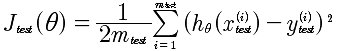 

	test下标表示测试集的意思
	h(θ)是通过线性回归得到的函数
	
对于逻辑回归来说，评价方法如下:

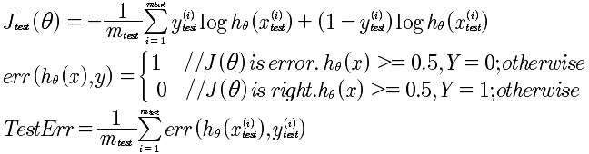 

## 10-3 模型选择：训练集，交叉验证集，测试集

对于模型的选择，例如下面的线性回归方程，d(degree)表示x的幂,d=1,2,3...10

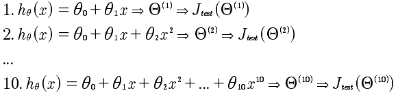 

那么，现在通过对Err(J_test( Θ^5 ))效果最好，那么，我们选择了Θ^5 但这并非是正确的，因为现在变成了对测试集的最好的拟合。所以，需要重新进行数据集的划分。

分别是：训练集 占数据总量60%，交叉验证集占20%,测试集占20%。评估的方法，依然是寻找最小偏差。

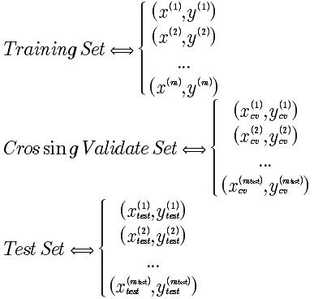 

偏差公式:

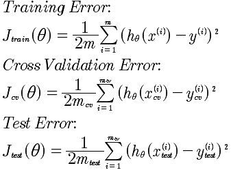 

到现在，对机器学习其实有了一个总体框架的认识。就是寻找拟合，通过训练集，写出拟合标准就是J(θ)，剩下的工作是寻找J(θ)的最小化的θ；因为在选择拟合函数h(θ)的时候，可能有多种选择，这没关系，把每一种情况计算出来，使用 J_cv(θ)来寻找最好的h(θ)模型.最后通过，测试集来进行测试。

对于模型的选择，就是根据某一个变量划分的模型，选择最好的那一个模型。事实上就是，绘制变量和J\_test(θ)的曲线，来找到J\_test(θ)最小的那一个。对于线性回归来说，是确定维度，那么维度d和J\_test(θ)就构成了函数曲线。

## 10-4 偏差与方差

求解的假设函数，要么是偏差要么是方差大。这是针对训练集和测试集来说的。如果是偏差，说明是欠拟合，如果是误差大说明是过拟合。所以搞清楚这个问题，非常重要，给了我们一个指示器，进行优化。

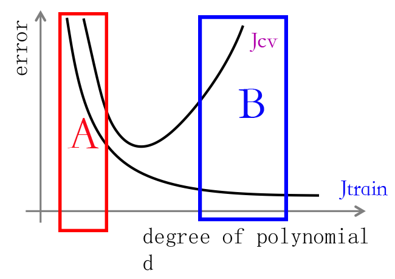 

	横坐标: d 表示多项式的最高次幂
	纵坐标: 表示误差
	
我们看到，当d的取值很小的时候，对于训练集来说产生的误差比较高，同样对于验证集来说也很高，这是一种欠拟合的形态。对应A的区域。再看B的区域，因为d的取值很高，所以对于训练集来说能够很好的拟合，但是，对于验证集来说，却误差很大。这说明是过拟合。

欠拟合，偏差的定义如下:
	
	1. J_train(θ) 很高
	2. J_cv(θ) 约等于 J_train(θ)

过拟合，误差的定义如下:

	1. J_train(θ) 很小
	2. J_cv(θ) 远远大于 J_train(θ)
	
上面的图告诉我们如何来确定是高偏差还是高误差。然后，后面的优化再对症下药。因为每一个参数的调整，要么产生偏差猫么产生误差。
## 10-5 正规化

正规化可以有效的解决过拟合的问题。同样，正规化可以有效的处理偏差和方差的问题。看下，正规化的表达式。

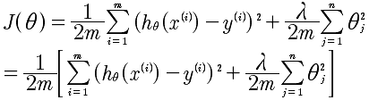

通过这个表达式，我们可以理解到，正则化是为了在选定的d的情况下的再次优化。是针对特定的d的细致优化。但是即使对于选定的d，依然可以进行再优化，那就是通过上面的正规化方法。通过对θ的惩罚来达到更加好的拟合。

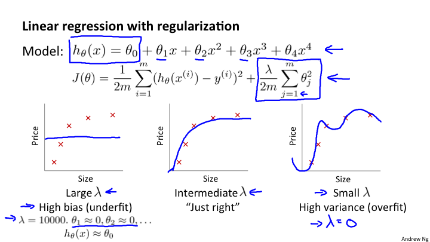

上面的图像展示了对于同一个d=4来说，选取不同的λ，可以产生不同的拟合。选择恰当的λ也可以实现正常的拟合。

那么对于误差公式来说：

**特别注意：** 训练集误差是没有正规化表达式的。正规化表达式是中间的过程优化的计算思想，而对于误差的最终描述是没有这一项的，这一点要搞清楚。

之间的图像和变化关系又是什么样的呢？

计算的过程如下表:

| λ取值 | 计算步骤1 | 计算步骤2 | 计算步骤3 |
| ---- | ------- | ----------|---------|
| 0    | min(J(θ)) | 得出 θ^(1) | 得出 J_cv(θ) |
| 0.01 | min(J(θ)) | 得出 θ^(2) | 得出 J_cv(θ) |
| 0.02 | min(J(θ)) | 得出 θ^(3) | 得出 J_cv(θ) |
| 0.04 | min(J(θ)) | 得出 θ^(4) | 得出 J_cv(θ) |
| ... | min(J(θ)) | ... | 得出 J_cv(θ) |
| 10 | min(J(θ)) | 得出 θ^(10) | 得出 J_cv(θ) |

那么，从中选择最小的 J_cv(θ)的值，就是我们需要的θ取值。

通过上面的表格，通过图像来看就会更加直观。将J_train(θ)和J_cv(θ)，两个误差函数进行绘制。

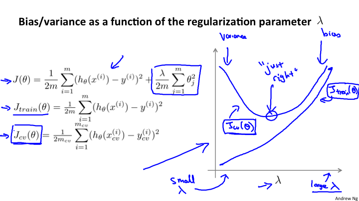

可以看到对于λ很小的时候，产生的开口很大，因为对于θ来说，没有惩罚，所以还是会产生高误差；而对于λ的增加，会对θ惩罚很大，最后会出现很接近。对于我们来说，选择中间的点是最合理的。

## 10-6 学习曲线

绘制学习曲线是非常有用的方法。能够检测你的学习算法，以及所处的问题是偏差还是方差问题。

### 高偏差（欠拟合）解释

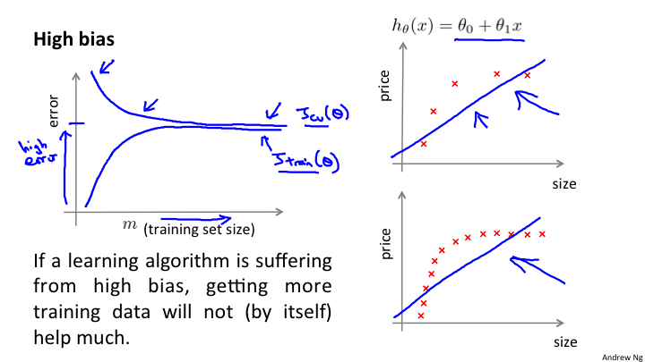

这张图是对高偏差的学习曲线的一个描述。坐标系描述，如下:

	error：纵轴表示误差数值
	m: 表示数据集个数。这一点需要注意，如果是训练集表示的训练集个数;而交叉验证集是使用的全体
	
学习曲线的解释:对于每一个训练集，训练出来的参数，应用到整个交叉验证集，计算出训练集误差；再应用到训练集，计算出训练误差。

对于图上的高偏差（欠拟合）的理解。对于J\_train(θ）在数据量很小的时候，也就是m=1,2... 很小的时候，因为h(θ)能够对训练集数据很好的拟合，所以J\_train(θ)就会很小；随着m的增加，会使得J\_train(θ)的偏差会逐渐增大；但是，当m增加到一定的数量，因为欠拟合，所以J\_train(θ)维持在一个较高的位置，但是不会再急速上升，而是平稳下来。

而对于 J\_cv(θ)的理解是这样的。当数据量很小的时候，m=1,2,...的时候，因为验证集的数据很少，所以不会很好的与h(θ)拟合，就会产生较大偏差，也就是error(J\_train(θ))会比较大；随着数据量的增加，逐渐的拟合度增加，误差值就会逐渐的变小;当数据量大到一定的程度的时候。J\_cv(θ)和J\_train(θ)就会很接近处于一致的位置。

这就是对于高偏差的解释。所以对于学习曲线来说，高偏差的特征是:

	1 J\_train(θ)和J\_cv(θ)比较接近，而且处于较高位置
	2 对于这样的情况来说，增加数据集是没有任何意义的
	
### 高误差（过拟合）解释

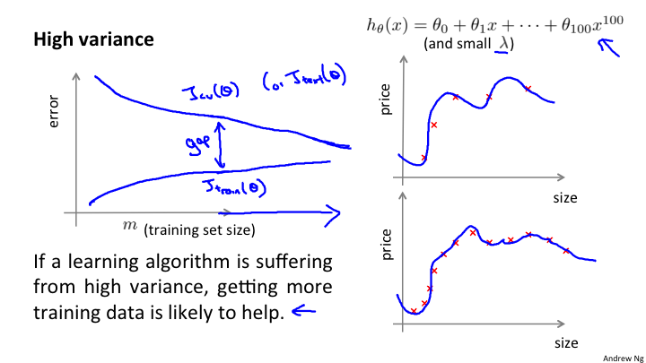

对于高误差（过拟合）的理解。对于J\_train(θ）在数据量很小的时候，也就是m=1,2... 很小的时候，因为h(θ)能够对训练集数据很好的拟合，所以J\_train(θ)就会很小；随着m的增加，会使得J\_train(θ)的偏差会逐渐增大；对于这一点上与高偏差是基本一致的。

而对于 J\_cv(θ)的理解是这样的。当数据量很小的时候，m=1,2,...的时候，因为验证集的数据很少，所以不会很好的与h(θ)拟合，就会产生较大偏差，也就是error(J\_train(θ))会比较大；随着数据量的增加，逐渐的拟合度增加，误差值就会逐渐的变小;而当训练集和验证集的数据使用完的时候，对于J\_train(θ)J\_cv(θ)和J\_train(θ)就会在一个位置保持很大的差距，也就是gap.

但是通过图像，可以看出，如果继续增加训练集和验证集的数据，二者会继续下降，所以增加数据集是有用的一个方法。

这就是对于高误差的解释。所以对于学习曲线来说，高误差的特征是:

	1 J\_train(θ)和J\_cv(θ)之间的差距较大。
	2 对于这样的情况来说，可以增加数据集来使得结果拟合的更好。

## 10-7 回顾和总结

最初提出的问题的解决方案如下:

| 序号 | 解决方案 | 适用的问题 |
| ----| ------- |---------|
| 1 | 获取更多的训练集 | 高误差（过拟合) |
| 2 | 尝试更小的特征集 | 高误差 (过拟合) |
| 3 | 增加特征集 | 高偏差（欠拟合) |
| 4 | 尝试使用多项式, 例如 (x^2, x1x2, etc) | 高偏差（欠拟合) |
| 5 | 增加λ | 高误差 (过拟合) |
| 6 | 减小λ | 高偏差（欠拟合) |

对于当前是高偏差还是高误差的判断，使用学习曲线来判断。

### 神经网络的优化
前面所描述的都是基于线性回归的描述，那么，基于神经网络的优化又是什么呢？面临着两个问题。

一、隐藏层数的选择。究竟是几层。这个问题的处理与多项式选择中的最高次幂是一样的。可以通过 J_cv(θ)的比较来得出最好的θ.

二、使用正规化来进行优化。一个大型的神经网络配置正规化修订，要比一个小型的神经网络更加准确。

可以通过正规化来进行过拟合的优化。

