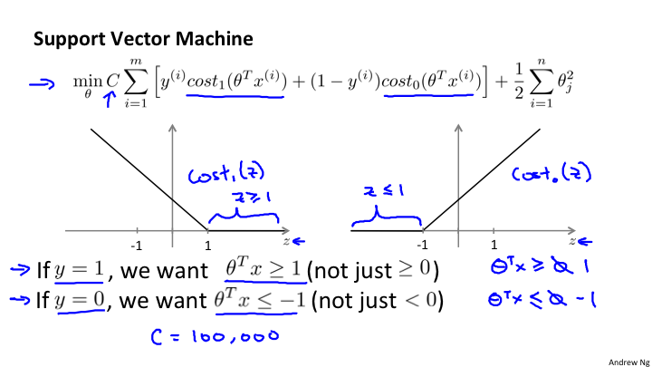
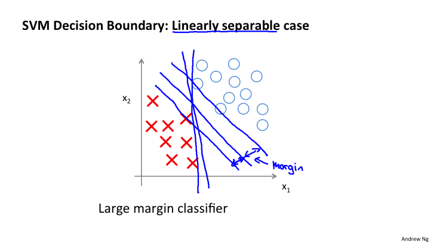
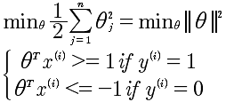
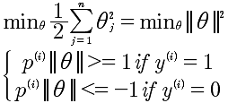
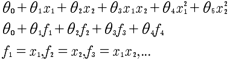
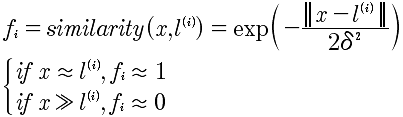
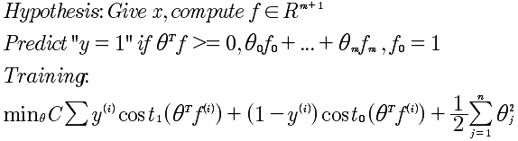

# Lesson12 支持向量机(SVM)

## 12-1 优化目标

支持向量机(SVM)在进行非线性学习的时候，显得更加强大。在很多工业和学术上使用的监督学习就是SVM。

最后计算的SVM优化函数如下:

注意C 是一个常量，而最后的正规化的λ没有了，但这其实是一回事，相当于乘以1/λ.

## 12-2 大间距分类器

上图，我们看到在最小化代价函数的时候，对于y=1时，θ^x >=1 则第一项为0；当y=0时，θ^x <=-1，则第一项为0. 所以当C足够大的时候，例如C=100000,那么min就是希望第一项为0才能达到最小化。这样就形成了一个决策边界。

从图上可以看到，其实本质上求解得到两种样本对于中间的决策边界的距离最大。注意，上面的所有分析是建立在C是很大的数值的假设基础上上的。

那么，对于其他的异常情况，例如在正样本中有负样本；负样本中有正样本。这种Case是否能够处理呢？这是可以的，当选取的C不是很大的时候，是可以很好的拟合的。

## 12-3 大距离分类器背后的数学原理

证明前提是C足够大，这样就变成了:

所以最小化了θ向量的模即可。

而对于 θ^T x^(i) 本质上是两个向量的内积θ^T x^(i) = p^(i) ||θ||，其中 p是x^i 在θ上的投影 p = ||x^(i) || * cosα。

变换后的表达式如下:

使用图形分析方式，我们知道 边界线与θ向量是垂直的，所以要想 ||θ||小， p^(i) ||θ|| >=1 ， 所以 只有 p^(i) 较大的时候，才能够使得θ较小。而 p 是x 到θ的投影，因为θ垂直于边界，所以p就是样本x到决策边界的距离，而p越大θ越小，所以最小化代价函数。经过这些分析，就清楚大距离原理。

关键点是将x到边界的距离进行可以运算化的过程。

## 12-4 核函数 I

现在我们要解决的是上图的非线性的分类问题。假设在 y = 1的情况下 θ0 + θ1x1 + θ2x2 + θ3x1x2 + θ4x1^2 + θ5x2^2 + ... >= 0 ，使用这个多项式来代替θ^T x 在计算量上是很大的，因为是多项式。所以进行变通:

那么f是什么？f表示的是x的近似值函数，也就是核函数，选择高斯核函数如下:

我们看到，当x与l接近的时候 f=1 表示很“相似";当x与l差得很远的时候，f=0 表示相差很大。

## 12-5 核函数 II

标记点l如何选择？通过将所有的样本点当做l，作为初始的选择，所以l有m个，与样本点是一样的。

SVM的核:

这里需要解释一下 x， 是指多个特征量组成的向量。如果有3个特征量，那就是 x1, x2, x3. 所以对于 f来说，是x向量与l向量之间的距离关系。

对于 x^\(1) 来说，产生的f^\(1)如下:

最终的支持向量机如下:

引入支持向量机的关键点，在于SVM在最小化代价函数的过程中的优化计算。这才是引入支持向量机的关键。只有这种方式，才能够快速的计算。所以SVM解决的是逻辑回归的非线性分类器的多项式快速计算问题。

对于在12-2的距离解释，实际上是一种解释。 

关于，C（C=1/λ)，

	很大的C，λ很小，意味着，低偏差，高误差
	较小的C，λ很大，意味着，高偏差，低误差
	
关于，δ^2

	很大的δ，意味着核函数变化度平滑，所以高偏差，低误差
	较小的δ，意味着核函数变化度剧烈，所以低偏差，高误差
	
## 12-6 使用SVM

使用SVM软件包,例如 liblinear, libsvm等

	1 选择C
	2 选择核函数
	3 不选择核函数直接使用 θ'x >=0 
	
选择的方法，

	1 如果n（特征值）很多,m（数据量）很小。可以考虑使用线性kernel，也就是不用kernel 函数
	2 如果n很多，m很多，并且样本可能是非线性的分类，考虑使用高斯核函数。
	
对于其他的核函数的使用要小心，必须符合 "Mercer's Theorem"，因为这些是被SVM优化的.

逻辑回归和SVM之间的选择。如果n>=m，使用线性核函数的SVM; 如果n很小（1-1000）,m中等程度（10-10，000）使用SVM并且高斯核函数. 如果n很小(n=1-1000),m很大(50,000+)，考虑使用逻辑回归或者不带核函数的SVM，因为带有核函数，会导致计算量非常大。

SVM的另外好处是比神经网络运行的速度要快。而且SVM是凸的，所以能够得到全局最小化。这一点很多时候比神经网络更好。

算法虽然很重要，但是更多的数据更重要。你需要的是学会肥西误差等技能。
	

