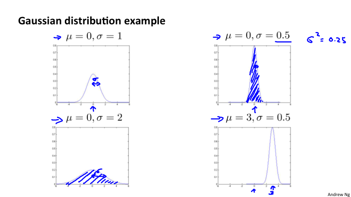
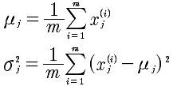
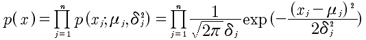

# Lesson15 异常检测
## 15-1 问题的动机
在一堆数据中，根据一定的阈值寻找出来那个异常的数据。许多购物网站就是这样来识别异常用户的，收集所有用户的行为特征，包括打字速度，页面停留时间等等，来找出哪些用户是异常的。

或者计算机集群，监控内存使用率，CPU使用率等，来找出异常的机器。

## 15-2 高斯分布
标准差 δ 决定了高斯分布的宽度。

## 15-3 异常检测算法

异常检测的算法是利用高斯概率分布来计算每一个特征量的概率，再相乘求出整体特征量的方法。但，这里要求特征量必须是独立的。但是，在机器学习中，即使不独立，效果依然不错。

算法如下:

1 选择xi

2 计算u和δ

3 给定样本x，计算p(x):

## 15-4 开发一个异常检测系统

具体做法，是引入标签的，交叉验证集和测试集。因为属于偏斜率数据，所以，计算查准率和召回率进行比较算法的优劣。

本来是非监督学习，现在引入了监督学习的评价方法。

## 15-5 异常检测 VS. 监督学习

通过上节，我们可以知道数据究竟是y=0还是y=1，也就是带有标签的数据。那么，既然数据可以是带有标签的，为什么不使用逻辑回归或者神经网络这些监督学习来预测是否是OK的？

| 区别 | 异常检测 | 监督学习 |
| ---- | ------ | ------- |
| 1 | 非常小的正样本和非常大的负样本；反之，亦然 | 正负样本数量差不错 |
| 2 | 异常的种类很多 不确定，所以无法进行预测 | 异常或者正常的情况是重复的，通过学习可以学习到|

那么，如果异常的数据很多，可以考虑尝试从异常检测转换到监督学习。

## 15-6 如何选择特征量

有些特征量可能不符合高斯分布，那么可以通过一些函数变换来产生高斯分布。例如:

	y = logx; y = x*x 

或者

	y = x1/x2

## 15-7 多元高斯分布

多元高斯分布是为了解决当有两个特征值相关联的好方法。看上图，对于上面蓝色的异常点，对于x1, x2 来说是正常的，所以无法被检测到。但是，放到所有的数据中观察，就会发现是异常的点。

## 15-8 多元高斯分布应用

方程定义如下:

