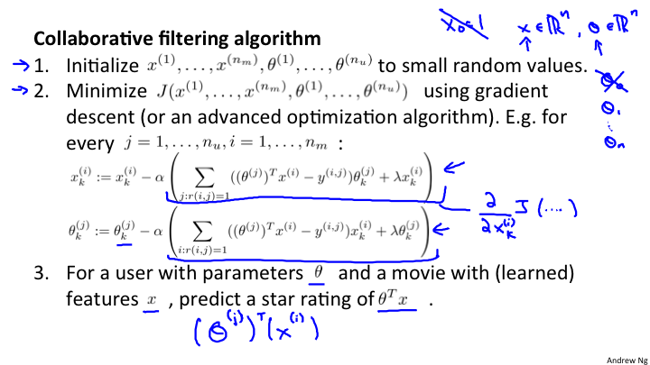

# Lesson16 推荐系统

## 16-1 形式化问题

学术界关注的很少关于推荐系统。

电影推荐问题，是系统对某个用户根据用户对现有电影的评分来对用户进行推荐其他电影的问题。那么，这个问题如何形式化表述呢？

| 电影 | Alice(1) | Bob(2) | Carol(3) | Dave(4) |
| --- | --------- |-------| ---------|---------|
| Love at last | 5 | 5 | 0 | 0 |
| Romance forever | 5 | ? | ? | 0 |
| Cute puppies of love | 5 | 4 | 0 | ? |
| Nonstop car chases | 0 | 0 | 5 | 4 |
| Sword vs. karate | 0 | 0 | 5 | ? |

	n_u = 用户数量
	n_m = 电影的数量
	r(i, j) = 1 如果用户j给电影i打分了是1
	y(i, j) = 0,1,...,5 用户j给电影i打的分 是 0,1,2,3,4,5
	
通过这些定义，就可以对推荐系统进行定义了。推荐系统要做的就是对上面"?"的地方给出推荐的分数。

## 16-2 基于内容的推荐

基于内容的推荐的原理是通过内容来寻找特征值，例如将电影的内容分解成两个特征值，分别是x1:爱情程度 x2:动作程度，每一个特征值的程度是属于[0,1]，而后使用线性回归进行预测的方法。

| 电影 | Alice(1) | Bob(2) | Carol(3) | Dave(4) | x1 | x2|
| --- | --------- |-------| ---------|---------|---|---|
| Love at last | 5 | 5 | 0 | 0 | 1.0 | 0.0|
| Romance forever | 5 | ? | ? | 0 | 0.9 | 0.1 |
| Cute puppies of love | 5 | 4 | 0 | ? | 0.99 | 0.01 |
| Nonstop car chases | 0 | 0 | 5 | 4 | 0 | 1 |
| Sword vs. karate | 0 | 0 | 5 | ? | 0.2 | 0.8 |

具体的算法如下:

其中 θ^(j) 表示的是对j个用户的线性回归.

那么，将所有的用户整合到一个线性回归的方程，如下:

但是，这种方法是依赖于内容的。而有些时候，是没有内容特征的，那么该如何处理呢？

## 16-3 协同过滤
这个算法最厉害的地方是能够自己学习特征，这样就解决上面所提到的特征问题。那么，能否系统自己学习特征值？

假设能够得到每一个用户的喜好向量，例如 θ^(1) 表示的是第一个用户的喜好，爱情片5分，动作片0. 接下来，要做的事，就是通过这些用户的喜好来学习出来特征量。这里的思想是什么？在前面的线性回归中，是有 Alice: (θ^(1))^T x^(1) = 5; Bob: (θ^(2))^T x^(1) = 5; Carol: (θ^(3))^T x^(1) = 0; Dave: (θ^(1))^T x^(1) = 0;

对于，第2节阐述的线性回归，是我们知道了 x 特征量，通过线性回归计算出θ。而现在，我们要做的事，通过参考的已知的θ来计算x，方法还是一样的。

接下来的算法事实上和上面的就是一样的。只不过现在是知道θ求解x，本质上没有任何区别。

现在的问题来了，初始的θ不一定准确，而θ和x似乎是鸡和蛋的关系，事实也是如此，二者互相推导，最后都收敛。

θ=>x=>θ=>x ...

所以θ可以使用随机初始化一个值计算出来x,用x在求θ，如此往复。随着数据逐渐增多，就会渐渐的收敛。

算法如下:

## 16-4 协同过滤算法

在上一节中阐述的算法，知道是x和θ的不停迭代最终导致的收敛。那么，其实可以将两个代价函数合并，统一计算，直接随机初始化x和θ，然后同时计算出二者。这里需要注意的一点是，x0=1 这一项是不存在的，也就是偏置项是不存在的，因为没有必要将一个特征固定为1，如果是1，那么系统会自己学习这个特征。如果x0不存在，那么θ0也就不存在了。所以x∈R^n , θ∈R^n .

将代价函数合并，然后使用梯度下降进行统一计算。

关于协同过滤算法理解。看算法，对于X和θ的初始化是随机初始化的，这点要特别的注意。进行和线性回归的对比如下表:

| 比对特性 | 线性回归 | 协同过滤算法 |
| -------| --------| -----------|
| 特征量 X | 已知数据 | 待求解数据 |
| 权重 θ | 待求解数据 | 待求解数据 |
| y值 | 已知数据 | 已知数据 |

通过这个表格就清楚的知道，对于协同过滤算法来说，是仅仅知道y(在电影评价中就是评分），而去寻找合适的θ和x来对应y.

## 16-5 向量化
所谓的推荐系统，就是能够对一个用户，将这个用户没有评价的商品打上一个分值。如果这个分值超过一个阈值，就可以将这个商品推荐给这个用户。这就是推荐系统的核心理念。

当推荐系统学习到了一些特征值，这些往往非常有意义。

当我们全部计算好了x和θ，那么通过下面的向量化的公式就非常预测和看到某个电影的评分了。

疑问：特征量的维度是多少呢？也就是说θ和x的维度是多少？貌似目前并没有给出合理的定义和求解方式？难道这个维度需要自己来选择1，2，... 某个数值吗？显然太多不行，太少也不行。

如果，需要看两个商品的关联度如何，通过下面的公式:

d = || x^\(i) - x^\(j) ||

这个公式计算了特征量的距离，如果d越小，说明越相似。前面说，通过对没有评价的商品进行评分可以推荐，其实本质上是寻找关联度最接近的商品，也就是d最小的几个商品。例如电影，当用户看过了一个电影，就可以通过关联度最大的其他几部电影推荐给用户，这就是推荐算法的理念。这和给一个电影打分后，选择最高的给用户是不冲突，因为打分是θx，而对于同一个用来说θ是一样的，所以就由x来决定。而在用户看过的电影中,一定是θx最大，所以也就是计算的推荐得分最高。

这种方法，可以用来进行对股票的相关性的测试上。

### 向量化的矩阵对应关系

对于这个矩阵来说，其中电影的总量是5(n\_m)，用户的数量是4(n\_u)。 上面就是矩阵对应的向量化关系.

## 16-6 均值归一化
现在的问题是，如果一个用户从来没有对任何电影评价过，那么，进行推荐的时候将会是对每一个电影都计算出来同样的结果，那么，这样就没有办法进行推荐。进行修订的方法是使用均值归一化，这样通过每一个电影的平均评分，来对该用户的评分进行修正处理。因为每一个电影的评分均值不同，所以最后就不会出现每一个电影都是同样的评分了。

对于矩阵行进行均值归一化，算法是:

	M = 行所有元素相加/总数
	每一行数据-M
	
最后计算出来的结果 (θ^\(j))^T (x^\(i) ) + M

这样做的好处是可以避免全是0的case.

