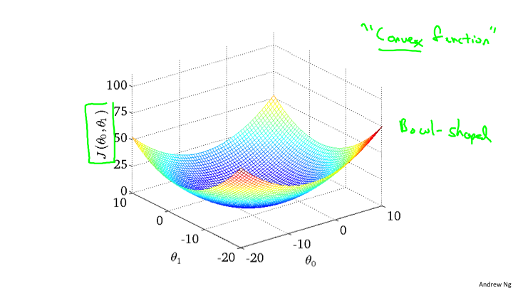
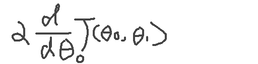

# Lesson2 单一特征量的线性回归
## 2-1
* Training Set: 训练集，表示所有训练的数据总和。
* m:表示测试的数据集的总量。例如有47条数据作为数据集。
* x:表示输入，例如目前预测是不同尺寸的房子的价钱，所以x表示的就是房子的大小。
* y:表示输出，例如房子的最终价钱就是输出。

(x,y)表示一个训练的例子。对于第几个使用的是上标。标注在x的右上角，在markdown中很难表示所以就正常的写了。(x(i),y(i))->对应一组数据。

例如，在视频中的房价的案例:

| 房子大小 | 房价 |
|---------| ---- |
| 2104 | 460 |
| 1416 | 232 |
| 1534 | 315 |

对于x来说，就是 x(1) = 2104, x(2) = 1416, x(3)=1534;对于y来说,y(1)=460, y(2)=232,y(3)=315。所以对于(x,y)来说就组成了一个3*3的矩阵用作计算。

## 监督算法的流程

针对这个流程就是搞清楚h是什么，来设计一个学习算法。所以使用了另外一个字符:θ.所以这个学习算法应该如下表述:

	hθ(x) = θ0 + θ1x
	经常为了表述方便写成 h(x)=θ0 + θ1x
	
对于房价的走势关系图，我们假设是一个线性的方程，也许这个并不是正确的，没关系，这作为一个基础会进行一点点的优化。这种线性函数的推测，称之为:**线性回归**

## 2-2
为了找到正确的θ的数值，所以需要一个成本函数来进行计算。原理上就是找到这样的θ使得，hθ(x)-y 的值最小。那么，这样的代价函数，使用的是平方差代价函数:

	J(θ0, θ1) = (1/2m)Σ(hθ(x(i)) - y(i))^2
	minize(J(θ0, θ1)) 就是代价函数的最小值，满足这样的 θ0和θ1就是要求的。
	hθ(x): 假设函数
	J: 代价函数
	
## 2-3
代价函数式如何进行工作的呢？例如，简化上面的h(x) = θ1x,也就是θ0 = 0这种简单情况。这时候的数据集类似如下:

| x | y |
|---------| ---- |
| 1 | 1 |
| 2 | 2 |
| 3 | 3 |

在这里我们需要建立两个坐标系，分别是x,y坐标系 和 J(θ), θ 坐标系。如下图

通过对θ的不断取值，来计算J，当取值到一定数量之后，找出其中的最小值，也就是J的最小值，就是我们要拟合计算出来的θ.

## 2-4
在前面的一节中通过二维的坐标就可以描述J和θ1的关系，可是，如果还有θ0，那么就是三个变量，那该如何处理呢？对于我们来说最直观的想法自然是计算一个三维曲面。大概会是下面的样子。

但事实上我们并不使用这种方式来表现。使用另外一种称作等高线的方法来表现。也就是说相同的J会在同一条线上，而最中心的线就是最小值。

## 2-5
关于J(θ0, θ1)的选取，我们的目标是选取到最小的J，那么如何来找到最小的J呢？对于J的函数来说，找到最小极值点，就是全部或者局部的最小值。所以为了找到极值点，从数学的角度来说，如果只有一个参数，那么直接求导入，令其等于0，即可。目前是二维的，所以我们需要选取一个初始的值(θ0, θ1)，然后逐步的逼近最小值。对于，这个原理我们可以明白，以一定的步长沿着切线的方向，变化θ0或者θ1，就会到达这个最小值。如下图：

从这张图上，我们看到在最低点的J。如果斜率大于0，那么θ需要逐渐变小；如果斜率小于0，那么需要θ逐渐变大。所以，能够得出如下的θ的逼近函数:

所以对于θ来说的逼近，是分别对θ0和θ1求偏导数的计算。

注意，这里的θ0和θ1，必须同时计算，“同时”这个词非常关键，因为不同时，偏导数就是有问题的。

## 2-6
在理解了梯度下降的算法的工作原理和公式之后，我们可以代入具体的先前的hθ(x)来计算。

这是最终的求导之后的计算结果。通过这个计算结果就可以对θ0和θ1进行逼近计算。

当进入了局部最低点，d(J(θ))/d(θ)=0，事实上梯度下降最到局部最低，就会产生这个结果，这时候θ将不会改变，也就是达到了最终的收敛。

对于线性回归来说，得到的局部最优解就是全局最优解，因为线性回归的代价函数是一个弓形，也就是是一个凸函数，所以只有一个极值点，也就是全局最优解。

目前每次进行梯度下降的时候使用的是全部数据，所以叫做“批量梯度下降","Batch 梯度下降". 到最后，你会看到 “随机梯度下降”和“小批量梯度下降”，来对这种大量数据的优化。

## 2-7
在前面我们看到的是只有两个维度，那么有多个维度的时候，该如何处理呢？需要应用到线性代数的知识。这是第三章主要阐述的内容，线性代数基础。
