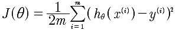
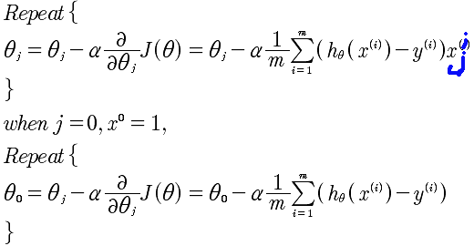

# Lesson4
## 4-1
前面所研究的都是基于单变量的预测模型，即通过房子的大小这一个特征量来拟合放假的曲线。然而，我们常常需要多个变量来进行拟合。现在的方程如下:

事实上这样一种表述方法，却可以通过向量的乘法来表示出来。

通过这里可以看到，所有的系数θ变量，x是所有x的向量。通过这里知道，因为引入了x0=1,所以x的维度是n+1，也就是 课程中常写的 R^n+1 .

同时，对于多特征量的线性回归的数据结构是这样的 (x1, x2, ..., xn, y)而不是[(x1,y1), (x2, y2), ..., (xn, yn)] 这种表述方式是单变量的线性回归.

## 4-2
再次回到梯度下降算法，

求min(J)的梯度递归下降逼近算法，是

## 4-3
特征值缩放。对于x1,x2,...xn这些特征值的取值可能范围偏差很大，例如房屋的大小1000-2000的范围，而房间的数量1-5.这样会导致梯度线的不均匀，使得梯度下降算法比较慢。所以正确的做法，是使得所有的特征值都落在[-0.5, 0.5]之间，这样进行归一化会更好的进行梯度下降。那么如何归一化，x在[a, b]区间取值，那么，可以使用下面的方法，相当于将该区间的中心移动到0, 所以就是 (a+b)/2移动到0,所以就是x-(a+b)/2 同时 将大小变化，所以最终就是: (x - (a+b)/2) / (b-a) 这就是归一化的方法。假设a = 100, b = 200，那么就是 (x-150)/100, 当x = 100时，是 -0.5, 当x = 200, 是+0.5，当x=130时-0.2,当x=150是0. 所以恰好归一化特征变量。

	normalize(x)=(x- (a+b)/2) / (b-a), x∈[a, b]
	
## 4-4
对特征值的优化可以加速迭代。那么同时α的选取也是非常重要的。如果选取过大，会使得J(θ)无法下降收敛；如果选取过小那么则会收敛的速度过慢。所以一般从:0.00001, 0.00003开始，同时观察J(θ)的函数图像看看是否是不停的收敛变小，趋于平缓，然后再进行调优α.目前关于J(θ)的观察，仅仅限于肉眼观测。因为机器观察也是有很多问题。目前的做法，依然是通过α和J(θ)的图像进行观察，来得知是否收敛。

对于 α 的取值，是从 0.001, 0.003, 0.01 ... 3倍速增加，来逐步观察得到最好的α。

## 4-5
非线性，而是多项式回归。

如果是这样，那么特征的归一化就非常的重要，例如x∈[1,10] 但是x^2=[1,100] x^3=[1,1000]. 所以本质上还是对x1,x2,x3这种特征量的归一，只是这时候变成了x1=x, x2=x^2, x3=x^3.

关于特征量的选取，上面可能x^3的变化太快，那么可以考虑x^1/2，这样可以使得变化没有那么快，以便得到更好的拟合。

不论是否是多项式对于θ的偏导数是没有影响的，只需要将每个θ的系数当做x即可。但是特征值的选取是个问题。

## 4-6
在这部分主要讲述的是数学的求解方法--标准方程法。例如，J(θ)的最值问题，是可以通过对θ的求导，来得到最值。同时，如果hθ(x)是线性的，也可以直接通过线性代数求解。

这里我们注意到X是非对角矩阵，也就是说X的逆矩阵是不存在，那么该如何计算呢？有个技巧，先将X变成对角矩阵，也就是乘以X的转至。所以，计算过程如下:

通过这样的一种数学方式也可以直接求出θ. 我的疑惑？就是θ的个数是n，所以要求解需要n个方程即可，可是m是大于n的，那么就是无法求解出θ，因为方程冗余了？这个需要使用OCTAVE 进行验证一下，奇怪的现象。

那么究竟是选择梯度下降还是使用标准方程呢？结论是：如果特征小于10^6，使用标准方程；否则，因为逆矩阵的计算较慢，需要使用梯度下降。另外，标准方程只适用于线性回归，也就是线性的h(x)表达式，所以并非适用于所有，在线性回归中速度会很快。

## 4-7
通过上面的计算，可以看到求θ的时候X乘以X的转至的逆矩阵不存在的问题。如果过是这样，需要做两点：

1 检查X矩阵是否有线性相关的向量。

2 可能是特征值过多，减少特征值的数量试试。
