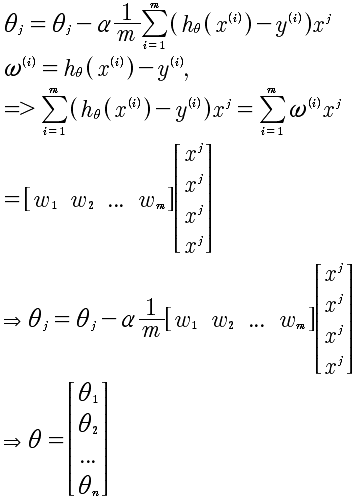

# Lesson5

主要讲述Octave语法以及Octave的应用。所以对于数据的理解，变成另外一个层面的理解，那就是向量化理解。我们之前在处理很多问题的时候，事实是程序思维，但是现在需要进化成更加抽象的向量思维。看下面一段代码:

	int sum = 0;
	int[] a = {1, 2, ..., 100};
	for (int i = 0; i < 100; i++) {
		sum += a[i];
	}
	
上面这段代码是非常典型的求和算法，那么，可以通过向量化的思维来使得这个操作更加快速。代码如下:

	sum = [1, 1, 1 ... 1] * [a[0], a[1], ..., a[n]]'

所以通过上面的例子，我们看出使用一行向量相乘就能处理循环的问题。那么，向量化方法的特点是什么呢？通过观察矩阵相乘，我们知道需要有如下特征：

* Σ 符号，需要有来产生加法云轩
* 需要有乘积

有了以上两点，就可以考虑使用向量或者矩阵相乘来进行优化处理。看下面的梯度下降算法的向量化计算。里面有 Σ 符号有相乘。那么，我们现在就来进行 θ 的向量化计算。

进行向量化计算的步骤如下:

