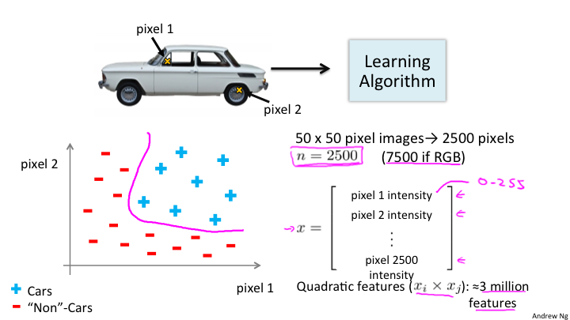
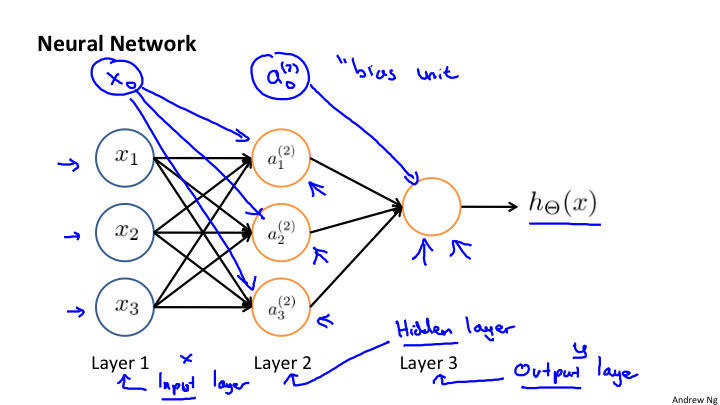
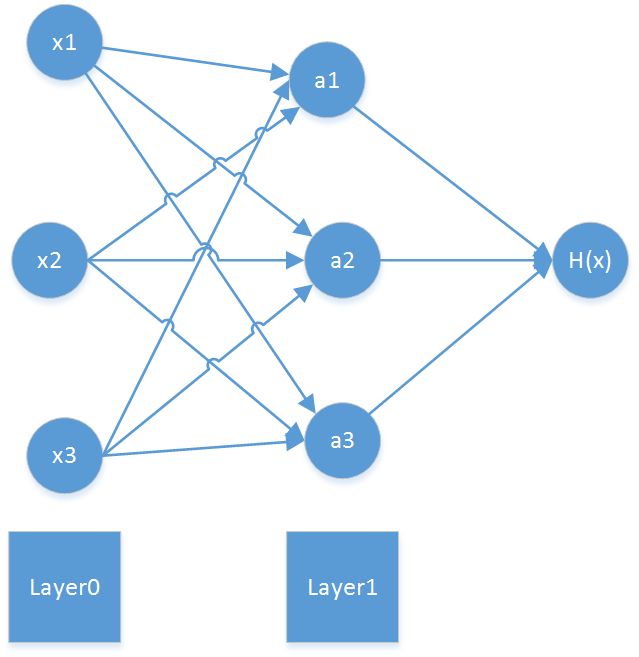
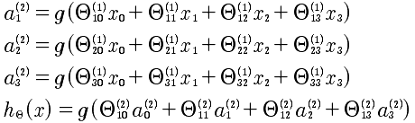
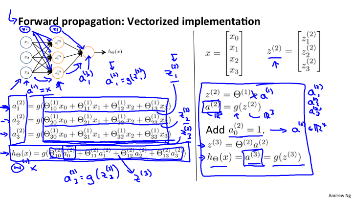
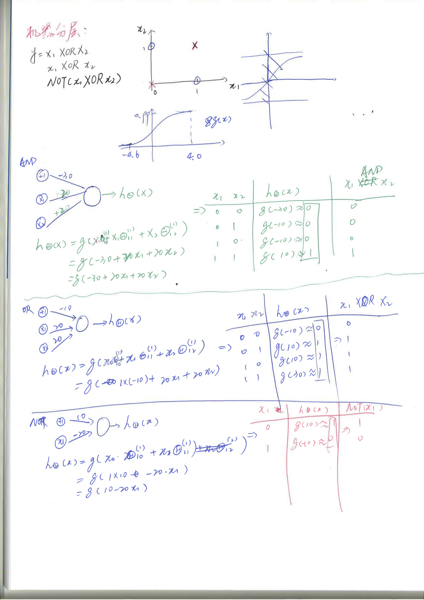
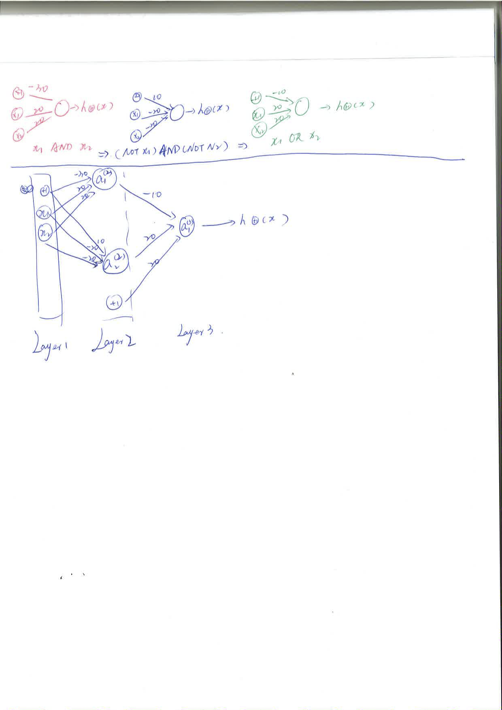

# Lesson8

## 8-1

神经网络的机器学习。在使用逻辑回归或者线性回归的时候如果参与的特征量过于多，那么基于多项式的函数将会出现及其复杂的现象。所以引入神经网络来解决这个问题。例如，在图像识别中的问题。

如图，将汽车图片的每一个像素的位置，是汽车用加号表示不是汽车用建好表示，那么有多少个像素相当于有多少个特征值，所以对于这个问题来说特征值就是图片的大小所包含的像素数。例如50*50 = 2500个像素，如果每个像素用3个字节来表示，那么就是2500 * 3=7500个字节，每一个字节作为一个特征量。换句话说是否是一个汽车是通过所有像素点来决定的，所以特征量就是所有像素点。

## 8-2
神经网络是模拟大脑的算法。任何一种传感器接入大脑，大脑都会自己学习如何处理这些数据。这就是神经网络的理论基础。

## 8-3

神经网络模型，是根据不同的层进行处理的。

具体的数学公式如下:

	层级: l
	a小标: i 第几个单元
	前一层的第几个单元: j
	a的上标是层级 l，下标是第几个单元i。 
	Θ上标是层级 l，下标第一个是i 也就是当前a的下标,另一个是j，表示的是前一层的第几个单元。
	对于Θ，每一行向量是计算的权重向量

## 8-4 8-5 8-6

神经网络的向前传播算法，向量化表述非常重要，如下图:

注意h(θ)的表述，是最后一层，也就是输出层. 在每一个增加偏差项会让公式更加完美，不仅仅是x0, 而是所有a0 = 1.

具体的计算实例参考下面的计算过程。

最后需要注意一点，对于神经网络的学习，最后的y是一个向量，如果有3个分类结果是 [1 0 0]' [0 1 0]' [0 0 1]' 而不是 y∈[1, 2, 3] 这样的问题。
