# Lesson9 神经网络学习
## 9-1 代价函数
还记的在逻辑回归中的分类问题,对进行0 1，这样的简单分类是容易解决的。可是如果是0 1 2 3 4 这样的分类讲是非常痛苦的。但是这些在神经网络中的处理确容易了许多。基于神经网络的代价函数如下:

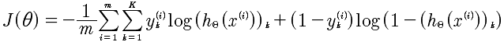

	K: 表示K类的数量。例如 0 1 2 3 那么就是4

逻辑回归函数

所以，这个公式与逻辑回归的代价函数进行对比.其实，仅仅是多了K个分类的处理。加入正规化的最终的函数如下:

在逻辑回归中最后一项是所有θ的平方和,在这里也是同样的。

	L： 表示层数
	i,j: 对应于每一层的每个Θ的下角标
	
### 代价函数的向量化
代价函数如下:

那么，在进行计算的时候，需要进行向量化，推导结果如下:

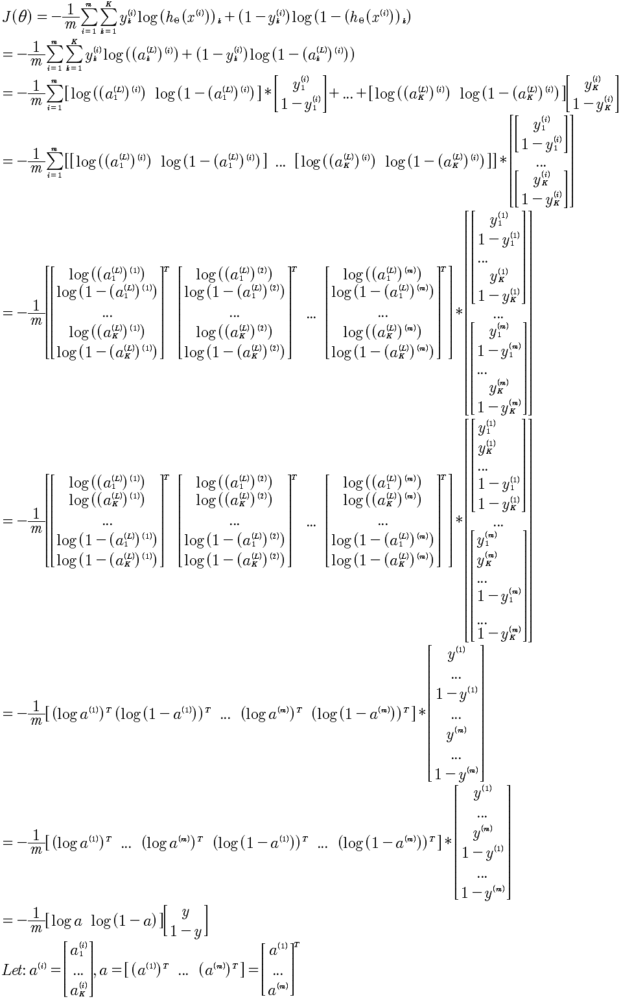

引入正规化λ的计算项是,所有的θ的平方，那么就是将Θ按照行展开，然后进行点乘计算即可。

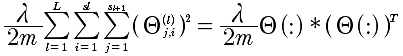

### 代价函数的计算
将每一层的a^\(l) 计算出来。带入J(Θ)即可。

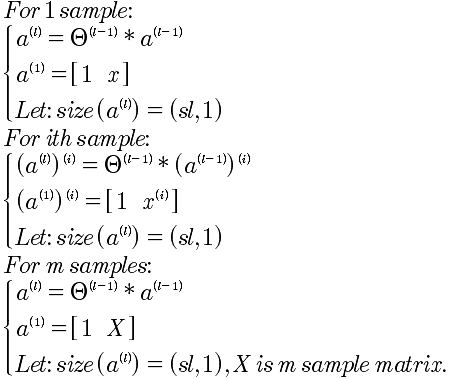

正规化λ项的计算，只需要将Θ展开成行向量，使用点乘即可。

### y的向量化
在给出的分类数据中y∈[1, 2, 3, ..., 10] 这样给出的每一条数据，而在代价函数中我们需要的是yk = [0 0 0 1 ... 0] 这种向量表述，也就是对于每一个y都要进行这种向量化转换。

	y=1, [1 0 0 0 0 ... 0]
	y=2, [0 1 .... 0]
	...
	
那么这种是如何计算呢？对于Octave来说计算步骤如下:
	
	1 先生成一个标准的循环向量。例如:Y1 = [1 2 3 ... 10 1 2 ... 10 ...] 从1 到 10，一共有length(y)个
	2 将y进行扩展和上面的Y1一样的维度，就是 Y2 = y .* [1 1 ... 1] 
	3 Y = (Y1 == Y2) 就是所要的矩阵

y∈{1, 2, 3, 4, 5},计算分类y的Octave代码如下:

	y = [ 1, 2, 3, 3, 5]

	Y1 = [];
	Y2 = [];

	for i = 1: length(y)
  	yy = y(i) * [1, 1, 1, 1, 1];
  	Y1 = [Y1, yy];
  
  	Y2 = [Y2, [1 2 3 4 5]];
	end

	Y1
	Y2

	Y = (Y1 == Y2)
	
输出结果:

	y = 1   2   3   3   5

	Y1 = 1   1   1   1   1   2   2   2   2   2   3   3   3   3   3   3   3   3   3   3   5   5   5   5   5

	Y2 = 1   2   3   4   5   1   2   3   4   5   1   2   3   4   5   1   2   3   4   5   1   2   3   4   5

	Y = 1   0   0   0   0   0   1   0   0   0   0   0   1   0   0   0   0   1   0   0   0   0   0   0   1
	

## 9-2 反向传播算法

要搞清楚反向传播算法，先看看向前传播算法的计算过程。如下图:

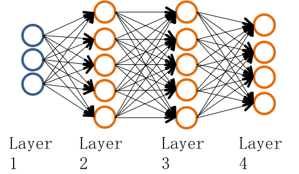

推导过程如下:

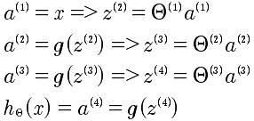

现在的问题是有了代价函数我们需要计算J(θ)的偏导数。正向计算太难了，于是使用了反向传播算法。

反向传播算法:

	

具体的计算梯度下降的偏导如下:

	

## 9-3 反向传播算法的解释

对delta来说，其实就是表示的偏差，那么所以就是使用偏微分即可表示。

	

另外，如果从正向的传播去思考反向传播也是可以的。因为i层的delta偏差，传递给i+1层是分散的。

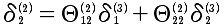	

这样理解和推导也是可以的。

### 反向传播算法完全解析
符号定义:

	l: 层序号，从1开始
	sl: 第 l 层的激励项数目
	sl+1: 第 l+1 层的激励项数目，而并非是(sl) + 1 的意思，而仅仅是下标的表示
	sl+2: 第 l+2 层的激励项数目
	δ: 表示的误差
	
本质上就是计算 ，那么就直接从这个入手记性推导.

J, a, z, Θ,之间是存在函数关系的，如下描述:

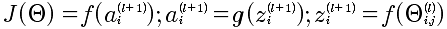

所以，能够有上面的J和Θ的复合函数的连续求偏导。下面就是逐个求解,从易到难:

第一步:

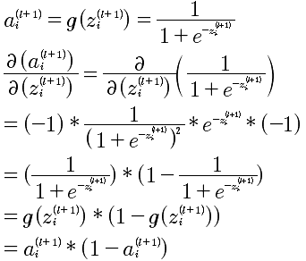

第二步:

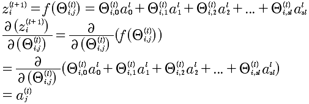

第三步 也是最难的:

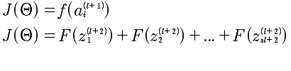

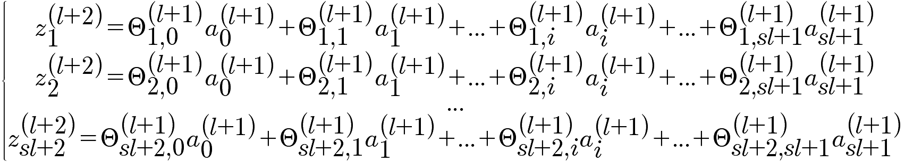

最后的计算结果如下:

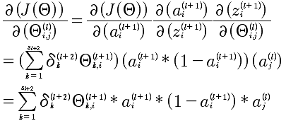

上面计算的是 l+1层中第i个δ，对于第l+1层的所有δ^(l)的向量化表示:

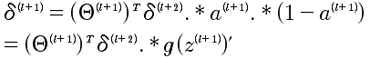

注意：这个表达式，就是NG在课程中直接给出的结论。这里给出了推导。

最终的表述，J对l层所有Θ的求导，结论为:

到这里，已经给出了J对Θ的偏导的计算方法。如果计算发现还有问题，那就是当l=L,第L+1层是不存在的,所以δ^\(L) 是需要计算出来的，不然是没有办法推导计算的。对于δ^\(L)的计算就相对来说，简单很多，因为最后一层可以直接和J(Θ）建立起函数关系，直接求导即可。

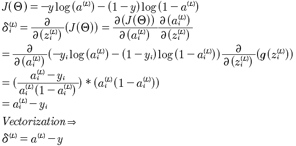

所以，综合以上所有推导，针对一个样本的反向传播算法如下:

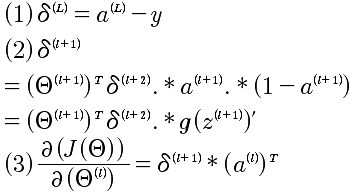

## 9-4 辗转参数
对于每一层的Θ来说都是一个矩阵，例如 s1=10, s2=10, s3=1 那么对应的 Θ1 10*11 矩阵， Θ2是10*11， θ3是 1*11.

对于δ来说 δ1 是 10*11 δ2是10*11 δ3是 1*11

对于计算函数来说

	fminunc(@costFunction, initialTheta, options)
	
现在的问题就是Θ变成初始化向量，现在的Θ是矩阵。

	thetaVec = [ Theta1(:); Theta2(:); Tehta3(:)];
	DVec = [D1(:); D2(:); D3(:)];
	Theta1 = reshape(thetaVec(1:110), 10, 11);
	Theta2 = reshape(thetaVec(111:220), 10, 11);
	Theta3 = reshape(thetaVec(221:231), 1, 11)
	
## 9-5 梯度检验

在实现反向传播算法的时候，因为算法过于复杂所以很容易出现细节的错误，而更要命的是细节的错误你可能无法发现。于是，这时候我们需要梯度检验来帮助鉴别梯度下降。

先看看导数的计算方法，对于给定函数J(Θ)，那么

	d(J(θ))/d(θ) = (J(θ+ε) - J(θ-ε))/2ε
	
那么，上面的方法应用到J(θ)，就可以用来计算偏导数了。具体的公式如下:

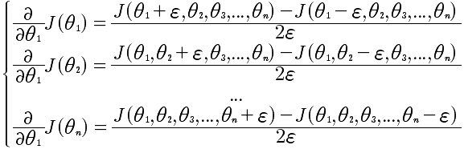

通过这个方法能计算出近似的偏导。

对于DVec来说每一个值的计算都与d(J(θ))/d(θ)比较接近或者相等才是正确的，那么用上面的简化近似算法就可以知道现在计算的Dvec是否正确的。 

## 9-6 随机初始化

这里我们使用的Θ是随机化的初始值，不能够全部设置成0，而是通过随机化，将Θ的值设置在[-ε, +ε]之间。

	Theta1 = rand(10, 11) * (2*INIT_EPSILON) - INIT_EPSILON;
	Theta2 = rand(1, 11) *  (2*INIT_EPSILON) - INIT_EPSILON;
	
## 9-7 放在一起

神经网络要解决几个问题，分别是输入的特征值数量和输出的分类数量，以及中间的隐藏单元。一般来说，对于中间隐藏层的数量越多会效果越好，但是计算速度会越慢。一般都是从一个隐藏层开始处理的。

训练一个神经网络的步骤如下:

	1 随机初始化权重
	2 实现向前传播，得到 hθ(x)对于任何一个x
	3 实现代码，计算代价函数J(θ)
	4 实现向后传播算法计算偏导 d(J(Θ)) / d(Θ)
	
	for i = 1:m
		执行向前和向后传播算法 得到 a以及δ
	5 使用梯度检查，数学方法计算d(J(Θ)) / d(Θ) 与 向后传播算法计算的进行比对
	6 使用梯度下降或者高级的向后传播来最小化J(θ）
	
## 9-8 无人车的应用
机器学习的应用。

## 总结
最后，总结神经网络的算法，需要从后向前推。为了求出每一层的θ，所以需要使用梯度下降来进行逐渐的逼近，求出θ；为了梯度下降算法来计算θ，那么需要计算 J(θ)的偏导；为了计算对每一层，注意是每一层的θ的偏导，需要使用反向传播来计算J(θ)的偏导；

那么，在从正向的捋顺一下，就是：

先把每一层的的所有θ随机初始化(注意是每一层），然后计算J(θ)的偏导数，最后使用梯度下降来逼近θ，求出最小的J(θ)。记着梯度的方法，就是最终的事：

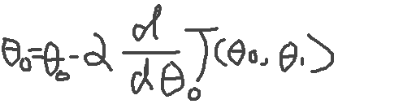